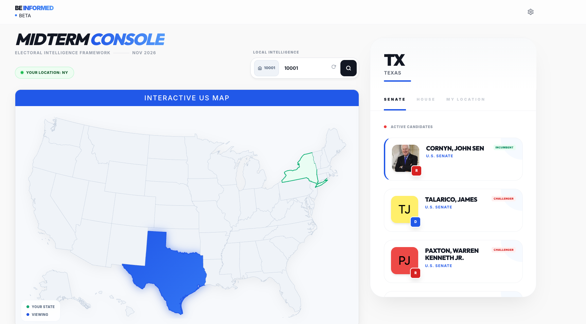

<p align="center">
    <b>BeInformed</b>
</p>
<p align="center">An LLM Powered Tool To Help Inform Your Vote</p>

---

## What is BeInformed?

BeInformed is an advanced, interactive platform designed to help prepare voters for upcoming elections, focusing on the 2026 midterm elections. Leveraging the power of LLMs, it mixtures programmatically gathered data and AI-driven insights to provide a comprehensive overview of candidates and electoral landscapes.

<p align="center">
    <picture>
      
    </picture>
</p>

Standard resources often leave voters overwhelmed by the complexity of local and regional races. **BeInformed** solves this by providing:

- **Spatial Briefing**: Navigate the electoral landscape with an interactive US map for rapid state-level intelligence.
- **Hyper-Local Targeting**: Use zip code lookup to instantly identify your district and specific candidates.
- **Intelligence Dossiers**: Access high-fidelity AI-generated reports on candidate backgrounds, funding, and positions.
- **Electoral Monitoring**: Visualize the balance of power with real-time status tracking of Senate and House seats.

<p align="center">
    <picture>
      
    </picture>
</p>

---

## Tech Stack

- **Core Framework**: [Quasar Framework](https://quasar.dev/) (Vue 3, Vite)
- **State Management**: [Pinia](https://pinia.vuejs.org/)
- **Data Visualization**: D3.js and TopoJSON for high-performance SVG mapping
- **Reporting Engine**: Markdown-based reports powered by AI backend integration
- **Storage**: Browser cookies for persistent user location data (Zip Code).

---

## Setup Guide

BeInformed is a UI built on top of another project of mine, [FraudeCode](https://github.com/mbranni03/fraudecode). FraudeCode is a bun cli tool that has a `plugin` feature that includes a learning plugin that is used to power this experience.

1.  **Install dependencies**

    ```bash
    npm install
    ```

2.  **Launch the development server**
    ```bash
    npm run dev
    ```
